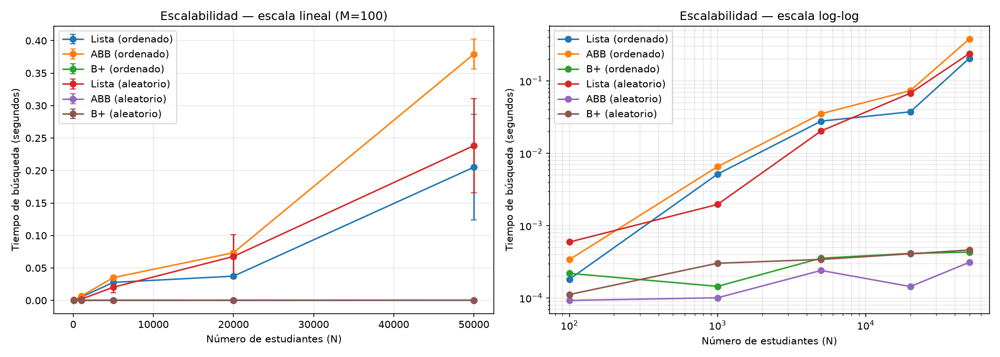

# Laboratorio 3: Sistema de Búsqueda de Estudiantes

## 1. Problema y objetivo

Una institución educativa necesita un sistema para buscar, insertar y listar
estudiantes (identificados por un ID único de matrícula) de forma eficiente.
El objetivo de este laboratorio es **estudiar experimentalmente** cómo tres
estrategias distintas de almacenamiento y búsqueda —Lista Enlazada, Árbol
Binario de Búsqueda (ABB) y Árbol B+— escalan a medida que crece el número
de estudiantes (N), y cómo el **orden de inserción** (ordenado vs. aleatorio)
afecta ese rendimiento.

## 2. Estructuras de datos y algoritmos

| Estructura | Búsqueda (caso promedio) | Búsqueda (peor caso) | Notas |
|---|---|---|---|
| Lista Enlazada | O(n) | O(n) | Recorrido secuencial; no aprovecha ningún orden. |
| ABB | O(log n) | O(n) | El peor caso ocurre con inserción ordenada (árbol degenerado, equivalente a una lista). |
| B+ | O(log n) | O(log n) | Balanceado por construcción (orden fijo = 4); hojas encadenadas para listar en O(n) sin volver a ordenar. |

Implementación: `src/estructuras.py`. Cada estructura expone `insertar()`,
`buscar()` y `listar_en_orden()`; ABB y B+ además exponen `altura()`.

**Verificación de correctitud:** se comprobó que `listar_en_orden()` de las
tres estructuras produce resultados idénticos entre sí y coincide con el
resultado de `sorted()` aplicado directamente sobre los datos de entrada,
para distintos tamaños de N y ambos órdenes de inserción.

## 3. Descripción del entorno experimental

### 3.1 Hardware
- CPU: Intel(R) Core(TM) i7-3770 @ 3.40GHz
- RAM: ~8 GB (8,470,851,584 bytes reportados por el sistema)
- Sistema operativo: Microsoft Windows 10 Pro

### 3.2 Software
- Versión de Python: 3.13.2
- Entorno: local, VS Code
- Librerías y versiones: ver `requirements.txt` (`matplotlib>=3.7`)

## 4. Metodología

### 4.1 Generación de los datos (`src/generador_datos.py`)
- Cada estudiante: `id` (entero único), `nombre`, `edad` (17–25), `promedio` (5.0–10.0).
- Los IDs se generan con `random.randint` y se garantiza unicidad con un `set`.
- Se usa una semilla distinta y fija por cada tamaño N (`semilla=n`), para que
  la generación sea reproducible.
- Para cada tamaño N se generan dos versiones del mismo conjunto de datos:
  - **Ordenado**: insertado en orden ascendente de ID.
  - **Aleatorio**: mismos datos, orden de inserción mezclado (`random.shuffle`).

### 4.2 Generación de las búsquedas
- Se generan M IDs de búsqueda tomados **sin reemplazo** del propio conjunto
  de datos (`random.sample`), garantizando que correspondan a estudiantes
  existentes.
- M es un parámetro del experimento, no fijo: se probaron dos valores (100 y 500).

### 4.3 Tamaños de entrada (N) — selección y justificación
- Se probaron varios valores de N (100, 1,000, 5,000, 20,000, 50,000), no un
  caso único, para poder observar la tendencia de escalamiento.
- Criterio: elegir N tal que el tiempo total de la corrida caiga idealmente
  entre ~1 segundo y ~5 minutos.
- En la práctica, el rango necesario para caer en esa ventana **difiere
  mucho entre estructuras**: con N=50,000 y M=500, la Lista (aleatorio)
  alcanzó 1.06s y el ABB degenerado (ordenado) alcanzó 1.90s — dentro de la
  ventana. En cambio, ABB(aleatorio) y B+ se mantuvieron muy por debajo de
  1s en todo el rango probado, incluso en N=50,000 (ABB aleatorio:
  0.00031s, B+ aleatorio: 0.00046s). Esto no se corrigió subiendo N aún
  más, porque:
  - El costo de *construcción* del ABB degenerado es O(n²): medido
    directamente, construir un único ABB ordenado con N=20,000 tomó ~20
    segundos; extrapolado a N=100,000 habría tomado varios minutos solo
    en construcción, antes de medir ninguna búsqueda.
  - El hecho de que ABB(aleatorio) y B+ no lleguen a 1 segundo ni con
    N=50,000 es en sí mismo evidencia de su complejidad logarítmica — es
    un resultado, no una falla del diseño experimental (ver sección 9).
- N=100 se agregó específicamente para poder observar la zona de "costos
  constantes", donde el overhead de las estructuras más complejas puede
  pesar más que su ventaja asintótica (ver sección 7).

### 4.4 Método para medir los tiempos
- `time.perf_counter()` alrededor del bloque de M búsquedas (no se mide la
  construcción de la estructura, solo la búsqueda).
- Cada combinación (estructura × orden de inserción × N × M) se repite
  **10 veces** para obtener una distribución de tiempos, no un solo dato.
- **Decisión de diseño importante:** la estructura se construye **una sola
  vez** por combinación de (estructura, orden, N), no en cada repetición.
  Repetir la construcción sería: (a) computacionalmente innecesario, ya
  que los mismos datos en el mismo orden siempre producen la misma
  estructura, y (b) en el caso del ABB degenerado, prohibitivamente lento
  (O(n²) por construcción). Solo se repite la medición de búsqueda, que sí
  puede variar entre corridas por factores del sistema.

### 4.5 Tratamiento de valores atípicos
- Se calculan la media y desviación estándar de las 10 repeticiones.
- Se descartan mediciones que se alejen más de 2 desviaciones estándar de
  la media, y se recalculan media/desviación con los datos restantes.
- Se registra cuántos valores fueron descartados por cada combinación
  (columna `outliers_descartados` en el CSV de resultados).
- Limitación reconocida: con solo 10 repeticiones, este método es simple y
  la propia desviación estándar tiene bastante incertidumbre (ver sección 9).

### 4.6 Estadísticas utilizadas
- Media y desviación estándar de los tiempos (tras el filtro de outliers).
- Número de repeticiones por punto (10).
- Altura del árbol (ABB y B+) en el momento de la medición, para relacionar
  altura con tiempo de búsqueda.

## 5. Cómo reproducir el experimento

```bash
# 1. Crear y activar un entorno virtual
python -m venv venv
venv\Scripts\activate            # En Windows
source venv/bin/activate         # En Mac/Linux

# 2. Instalar dependencias
pip install -r requirements.txt

# 3. (Opcional) Ajustar parámetros en src/experimento.py:
#    TAMANOS_N_PRUEBA, VALORES_M, REPETICIONES

# 4. Correr el experimento (genera resultados/resultados_experimento.csv)
python -m src.experimento

# 5. Generar las gráficas a partir del CSV (no vuelve a correr el experimento)
python -m src.graficas

# 6. (Opcional) Correr la demo interactiva
python -m demo.demo_interactiva
```

## 6. Resultados

### Parámetros del experimento

- **N (tamaños de entrada):** 100, 1,000, 5,000, 20,000, 50,000
- **M (búsquedas por corrida):** 100, 500
- **Repeticiones por combinación:** 10
- **Órdenes de inserción evaluados:** ordenado (ascendente por ID) y aleatorio
- **Semilla de generación de datos:** `semilla=n` (una semilla distinta y fija por cada N)
- **Total de combinaciones medidas:** 5 (N) × 2 (M) × 2 (orden) × 3 (estructuras) = 60 mediciones, cada una con 10 repeticiones

Datos completos en `resultados/resultados_experimento.csv`.

### Gráfica de escalabilidad



*Izquierda: escala lineal (M=100). Derecha: misma data en escala log-log, donde
una pendiente de ~1 indica O(n) y una curva casi plana indica O(log n).*

### Tabla resumen — tiempo de búsqueda (M=100, 10 repeticiones)

| N | Estructura | Orden | Media (s) | Desv. estándar (s) | Altura |
|---|---|---|---|---|---|
| 100 | Lista | ordenado | 0.000181 | 0.0000048 | — |
| 100 | ABB | ordenado | 0.000339 | 0.0000007 | 100 |
| 100 | B+ | ordenado | 0.000219 | 0.0000122 | 5 |
| 100 | Lista | aleatorio | 0.000594 | 0.0000523 | — |
| 100 | ABB | aleatorio | 0.0000926 | 0.0000353 | 12 |
| 100 | B+ | aleatorio | 0.000112 | 0.0000008 | 5 |
| 1,000 | Lista | ordenado | 0.00515 | 0.000148 | — |
| 1,000 | ABB | ordenado | 0.00654 | 0.000208 | 1,000 |
| 1,000 | B+ | ordenado | 0.000145 | 0.0000007 | 7 |
| 1,000 | Lista | aleatorio | 0.00196 | 0.000130 | — |
| 1,000 | ABB | aleatorio | 0.000101 | 0.0000005 | 21 |
| 1,000 | B+ | aleatorio | 0.000302 | 0.0000173 | 7 |
| 5,000 | Lista | ordenado | 0.0278 | 0.000440 | — |
| 5,000 | ABB | ordenado | 0.0352 | 0.0000743 | 5,000 |
| 5,000 | B+ | ordenado | 0.000355 | 0.0000185 | 8 |
| 5,000 | Lista | aleatorio | 0.0203 | 0.00811 | — |
| 5,000 | ABB | aleatorio | 0.000240 | 0.0000013 | 27 |
| 5,000 | B+ | aleatorio | 0.000341 | 0.0000007 | 8 |
| 20,000 | Lista | ordenado | 0.0374 | 0.000232 | — |
| 20,000 | ABB | ordenado | 0.0735 | 0.000311 | 20,000 |
| 20,000 | B+ | ordenado | 0.000413 | 0.0000163 | 10 |
| 20,000 | Lista | aleatorio | 0.0678 | 0.0338 | — |
| 20,000 | ABB | aleatorio | 0.000144 | 0.0000010 | 34 |
| 20,000 | B+ | aleatorio | 0.000408 | 0.0000017 | 10 |
| 50,000 | Lista | ordenado | 0.2052 | 0.0813 | — |
| 50,000 | ABB | ordenado | 0.3794 | 0.0232 | 50,000 |
| 50,000 | B+ | ordenado | 0.000430 | 0.0000074 | 10 |
| 50,000 | Lista | aleatorio | 0.2384 | 0.0728 | — |
| 50,000 | ABB | aleatorio | 0.000311 | 0.0000265 | 40 |
| 50,000 | B+ | aleatorio | 0.000461 | 0.0000162 | 10 |

*Tabla filtrada a M=100 por espacio; el detalle completo con M=500 está en el CSV.*

### Alturas — resumen

| N | Altura ABB (ordenado) | Altura ABB (aleatorio) | log₂(N) aprox. |
|---|---|---|---|
| 100 | 100 | 12 | 6.6 |
| 1,000 | 1,000 | 21 | 10.0 |
| 5,000 | 5,000 | 27 | 12.3 |
| 20,000 | 20,000 | 34 | 14.3 |
| 50,000 | 50,000 | 40 | 15.6 |

El B+ se mantuvo con altura constante entre 5 y 10 en todo el rango de N probado.

## 7. Interpretación y comparación con la teoría

**¿Los resultados se comportan como predice la complejidad teórica?**
Sí. En escala log-log, Lista y ABB(ordenado) muestran pendiente pronunciada
(consistente con O(n)), mientras que ABB(aleatorio) y B+ se mantienen casi
planas (consistente con O(log n)). Al multiplicar N por 500 (de 100 a 50,000),
el tiempo de la Lista se multiplicó por ~1,100x, mientras que el ABB aleatorio
solo se multiplicó por ~3.4x.

**¿En qué situaciones el ABB deja de comportarse como O(log N)?**
Cuando los datos se insertan en orden ascendente de ID. En ese caso el árbol
se degenera: cada nodo queda con un solo hijo, y la altura termina siendo
exactamente igual a N (confirmado en la tabla de alturas: para todo N
probado, altura ABB(ordenado) = N). El ABB deja de comportarse como árbol y
pasa a comportarse como una lista enlazada, tanto en altura como en tiempo
de búsqueda.

**¿Qué relación existe entre la altura del árbol y el tiempo de búsqueda?**
Es directa: a mayor altura, mayor tiempo de búsqueda, porque cada búsqueda
recorre en el peor caso un camino de longitud igual a la altura. Con
inserción aleatoria, la altura crece de forma logarítmica (cercana a
log₂(N), aunque algo por encima por no ser un árbol perfectamente
balanceado), y el tiempo de búsqueda se mantiene casi plano. Con inserción
ordenada, la altura crece linealmente con N, y el tiempo de búsqueda crece
en la misma proporción.

**¿Qué ocurre cuando los datos se insertan ordenadamente?**
El ABB pierde por completo su ventaja teórica sobre la Lista: para N=50,000,
el ABB(ordenado) (0.379s) termina siendo incluso más lento que la propia
Lista (0.205s/0.238s), pese a que en teoría el ABB debería ser más rápido.

**¿Qué diferencias aparecen entre los casos aleatorios y ordenados?**
Para la Lista, prácticamente ninguna — es O(n) sin importar el orden de
inserción, ya que no tiene ninguna estructura jerárquica que aprovechar.
Para el ABB, la diferencia es drástica: a N=50,000, el ABB(aleatorio)
(0.00031s) es aproximadamente 1,200 veces más rápido que el ABB(ordenado)
(0.379s). Para el B+, casi no hay diferencia entre órdenes de inserción,
porque está balanceado por construcción independientemente del orden.

**¿A partir de qué tamaño de entrada comienzan a ser claramente visibles
las diferencias entre estructuras?**
Ya son visibles desde N=1,000: ahí el ABB(aleatorio) (0.000101s) es ~50
veces más rápido que la Lista (0.00515s/0.00196s). La brecha se amplía
notablemente al seguir creciendo N.

**¿Existen costos constantes que hagan que dos algoritmos con diferente
complejidad tengan tiempos similares (o invertidos) para entradas pequeñas?**
Sí. Con N=100, el ABB(ordenado) (0.000339s) fue más lento que la propia
Lista(ordenado) (0.000181s), a pesar de que el ABB tiene mejor complejidad
teórica. Con N tan pequeño, el overhead de crear nodos adicionales, seguir
punteros entre ellos y hacer comparaciones extra en el árbol pesa más que
el ahorro asintótico que ofrece O(log n) frente a O(n). La ventaja real del
ABB/B+ solo se vuelve evidente a partir de cierto N.

## 8. Principales hallazgos

1. El orden de inserción es más determinante que la estructura en sí para
   el ABB: un ABB mal insertado (ordenado) puede terminar siendo más lento
   que una simple Lista Enlazada.
2. El B+ fue la estructura más estable y rápida en todos los escenarios,
   manteniendo su tiempo de búsqueda casi constante (entre 0.00011s y
   0.00046s) incluso cuando N se multiplicó por 500 — consistente con estar
   balanceado por construcción, sin depender del orden de inserción.
3. La altura del árbol predice directamente el tiempo de búsqueda: con
   inserción ordenada, altura = N; con inserción aleatoria, altura ≈
   1.6–2.6× log₂(N).
4. Para entradas pequeñas (N≈100), el overhead constante de las estructuras
   de árbol puede revertir la ventaja teórica frente a estructuras más
   simples como la Lista.

## 9. Limitaciones del experimento

- **Entorno de medición no completamente aislado.** Las mediciones se
  corrieron en una laptop de uso personal (Windows), no en un servidor
  dedicado con carga controlada. Aunque se evitó correr otros programas
  pesados durante la medición, no se garantiza un aislamiento total de
  procesos en segundo plano del sistema operativo. Esto puede introducir
  variabilidad adicional, especialmente visible en los valores más altos
  de desviación estándar (p. ej. Lista aleatorio, N=5,000: std=0.0081s
  sobre una media de 0.0203s, ~40% de variación relativa).

- **Rango de N explorado limitado por el costo de construcción, no de
  búsqueda.** El ABB con inserción ordenada tiene costo de construcción
  O(n²) (cada inserción recorre la cadena completa). Esto hizo que N
  mayores a 50,000 tomaran varios minutos solo en construir el árbol
  degenerado, por lo que se decidió no explorar N más grandes. Esta es
  una limitación práctica de tiempo de ejecución, no evidencia de que la
  complejidad de búsqueda cambie a partir de ese punto.

- **El B+ no alcanzó tiempos de búsqueda dentro de la ventana de 1s-5min
  recomendada**, incluso en el N más grande probado (50,000). Esto es
  consistente con que B+ es O(log n) con una base de branching alta (orden
  configurado en 4): su tiempo de búsqueda crece tan lento que llegar a
  1 segundo requeriría un N varios órdenes de magnitud mayor, impráctico
  para este estudio. Por lo tanto, las conclusiones sobre B+ se basan en
  la *tendencia* observada (casi plana), no en una medición dentro de la
  ventana recomendada.

- **El orden del árbol B+ se mantuvo fijo en 4** para todo el experimento.
  No se estudió cómo cambia el rendimiento al variar ese parámetro, que
  podría ser una extensión interesante pero queda fuera del alcance de
  este laboratorio.

- **El tratamiento de outliers (filtro a 2 desviaciones estándar) es un
  método simple.** Con solo 10 repeticiones, la estimación de la
  desviación estándar en sí misma tiene bastante incertidumbre. Un
  análisis más robusto habría usado más repeticiones o un método basado
  en mediana/rango intercuartílico.

- **Qué NO se puede concluir de estos datos:** no se puede afirmar que
  estos tiempos absolutos (en segundos) sean representativos de otro
  hardware o lenguaje de programación — son específicos de esta máquina,
  esta versión de Python y esta implementación particular. Lo que sí es
  generalizable es la *tendencia relativa* entre estructuras (orden de
  magnitud de las diferencias, forma de las curvas), que es consistente
  con la teoría de complejidad computacional independientemente del
  hardware.

## 10. Uso de herramientas de IA

### Proceso de desarrollo

Este proyecto se desarrolló con apoyo de **Claude (Anthropic)** a lo largo de todo el proceso, en dos etapas:

1. **Etapa exploratoria (Google Colab):** el trabajo comenzó como un
   ejercicio de práctica en Colab, implementando primero una Lista
   Enlazada simple para el sistema de búsqueda de estudiantes, con el fin
   de familiarizarme con el problema antes de abordar estructuras más
   complejas (ABB, B+). Esta etapa sirvió como base conceptual, pero no
   se usó para las mediciones oficiales del informe.

2. **Etapa de implementación final (proyecto local en VS Code):** siguiendo
   la recomendación de no medir tiempos de ejecución en entornos
   compartidos como Colab, el proyecto se migró a un entorno local,
   reestructurado como un proyecto modular (`src/`, `demo/`, `resultados/`)
   con las tres estructuras completas (Lista, ABB, B+), medición
   estadística con tratamiento de outliers, y generación de gráficas
   reproducibles desde un CSV.

A lo largo de ambas etapas, Claude ayudó a: discutir conceptos de
estructuras de datos, generar y depurar código, sugerir metodología
estadística, estructurar las gráficas, diagnosticar errores de ejecución
(incluyendo un problema de rendimiento O(n²) en la construcción del ABB
degenerado, detectado y corregido durante las pruebas), y organizar esta
documentación.

### Verificación del estudiante

Como estudiante, verifiqué explícitamente los siguientes puntos antes de
entregar este trabajo:

1. **Los datos utilizados son reales:** el archivo
   `resultados/resultados_experimento.csv` fue generado ejecutando
   `python -m src.experimento` en mi propia máquina; no fue generado,
   editado ni inventado por la IA. Verifiqué el contenido del CSV
   directamente antes de usarlo para las tablas y gráficas.

2. **Los cálculos son correctos:** verifiqué manualmente que la altura
   del ABB con inserción ordenada coincide exactamente con N en todos
   los casos (comportamiento esperado de un árbol degenerado), y que la
   altura con inserción aleatoria se aproxima a log₂(N), consistente con
   la teoría.

3. **Las gráficas representan correctamente los datos:** comparé
   visualmente los valores de `resultados_experimento.csv` contra los
   puntos graficados en `escalabilidad.png` para confirmar que
   corresponden.

4. **Las conclusiones corresponden a los resultados obtenidos:** cada
   afirmación en la sección 7 (Interpretación) cita un valor numérico
   específico de la tabla de resultados, no una afirmación genérica de
   "se comportó como se esperaba".

> TODO: completar/ajustar con el formato específico del código de honor
> enviado por el curso, si requiere una estructura distinta a esta.

## 11. Guía rápida para la sustentación

| Lo que puede preguntar el evaluador | Dónde está la respuesta |
|---|---|
| Problema y objetivo | Sección 1 |
| Estructuras y algoritmos usados | Sección 2 |
| Hardware y software | Sección 3 |
| Tamaños de entrada y por qué esos | Sección 4.3 |
| Número de repeticiones | Sección 4.4, columna `repeticiones` del CSV |
| Cómo se generaron los datos | Sección 4.1 |
| Cómo se generaron las búsquedas | Sección 4.2 |
| Método para medir tiempos | Sección 4.4 (`time.perf_counter()`) |
| Tratamiento de outliers | Sección 4.5 (filtro 2σ) |
| Estadísticas usadas | Sección 4.6 (media, desviación estándar) |
| Tablas y gráficas | Sección 6 |
| Interpretación vs. teoría | Sección 7 |
| Principales hallazgos | Sección 8 |
| Limitaciones | Sección 9 |
| Cómo reproducir el experimento | Sección 5 |

**Preguntas que probablemente hagan en vivo, con respuesta corta lista:**

- *"¿Por qué el ABB a veces es más lento que una lista?"* → Cuando se
  inserta en orden ascendente, el árbol se degenera (altura = N), perdiendo
  toda ventaja teórica. Ver sección 7.
- *"¿Por qué no llegaste a 1 segundo con el B+?"* → Porque B+ es O(log n)
  con una base alta; llegar a 1s requeriría un N poco práctico. Ver
  limitación en sección 9.
- *"¿Cómo sabes que tu código funciona bien?"* → Verifiqué que
  `listar_en_orden()` de las tres estructuras da resultados idénticos
  entre sí y coincide con `sorted()` de Python.
- *"¿Por qué empezaste con Colab si al final no se usó para medir?"* →
  Colab sirvió como etapa exploratoria para entender el problema con una
  estructura simple (lista) antes de implementar las tres completas; las
  mediciones oficiales se hicieron en un entorno local, siguiendo la
  recomendación de evitar la variabilidad de entornos compartidos.
- *"¿Qué parte hizo la IA y qué parte hiciste tú?"* → La IA ayudó a
  generar el código base y a estructurar el análisis; yo verifiqué cada
  resultado, corrí los experimentos en mi propia máquina, diagnostiqué y
  corregí los problemas de rendimiento que surgieron (ver el proceso de
  depuración en sección 10), y redacté la interpretación final con los
  números reales obtenidos.

## Estructura del repositorio

```
laboratorio3_sistema_busqueda/
├── README.md
├── requirements.txt
├── src/
│   ├── generador_datos.py
│   ├── estructuras.py
│   ├── medicion.py
│   ├── experimento.py
│   └── graficas.py
├── demo/
│   └── demo_interactiva.py
└── resultados/
    ├── resultados_experimento.csv
    └── graficas/
        └── escalabilidad.png
```